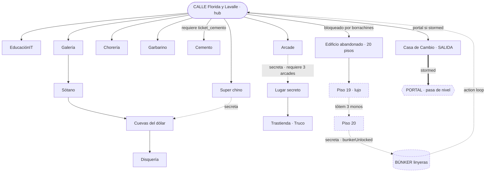
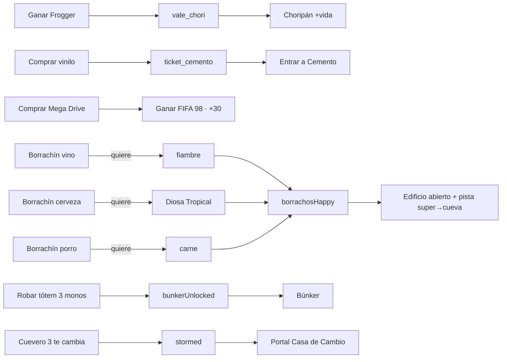
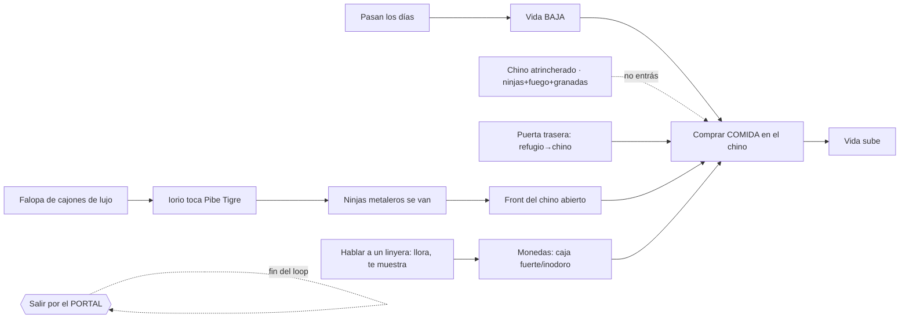

# 🕸️ GRAFO del Nivel 1 — Florida y Lavalle

El **knowledge graph** del nivel: todos los nodos (lugares, personajes, ítems, flags) y cómo se
conectan. Es el mapa que junta las **aristas** declaradas en cada ficha de
[`edificios/`](edificios/) y [`personajes/`](personajes/). Ver
[TECNICAS.md](../TECNICAS.md) para por qué se modela así.

> **Estado:** Draft. Mezcla lo **implementado** (la mayoría) con lo **diseñado/pendiente** (el
> tótem→búnker→loop y el colapso en ruinas). Lo pendiente va punteado en el diagrama.

## Diagrama (lugares + gating)



## Cadenas de dependencia (quest DAG / lock-and-key)



## Índice de nodos (fichas)

### Lugares / edificios → [`edificios/`](edificios/)
| Nodo | Sala(s) | Ficha |
|---|---|---|
| `calle` | 0 | [calle-florida-lavalle.md](edificios/calle-florida-lavalle.md) |
| `educacionit` | 1–3 | [educacionit.md](edificios/educacionit.md) |
| `arcade` (+ secreto/truco) | 4, 9, 10 | [arcade.md](edificios/arcade.md) |
| `choreria` | 5 | [choreria.md](edificios/choreria.md) |
| `galeria` + `sotano` | 6, 7 | [galeria-sotano.md](edificios/galeria-sotano.md) |
| `cuevas_dolar` (+ disquería) | 8 | [cuevas-del-dolar.md](edificios/cuevas-del-dolar.md) |
| `garbarino` | 11 | [garbarino.md](edificios/garbarino.md) |
| `cemento` | 12 | [cemento.md](edificios/cemento.md) |
| `casa_cambio` | 13 | [casa-de-cambio-oficial.md](edificios/casa-de-cambio-oficial.md) |
| `super_chino` | modo | [super-chino.md](edificios/super-chino.md) |
| `edificio_abandonado` (+ búnker) | 14–33 | [edificio-abandonado.md](edificios/edificio-abandonado.md) |

### Personajes → [`personajes/`](personajes/)
| Nodo | Ficha |
|---|---|
| `borrachines` (vino/cerveza/porro) | [borrachines.md](personajes/borrachines.md) |
| `cueveros` (1/2/3) | [cueveros.md](personajes/cueveros.md) |
| `linyera` (guardián joyas / 20 gurú / tirados ruina / búnker) | [linyeras.md](personajes/linyeras.md) |
| `chino` (+ familia + ninjas) | [chino.md](personajes/chino.md) |
| `tahur` | [tahur.md](personajes/tahur.md) |
| `iorio` (quest del loop: falopa → Pibe Tigre) | [iorio.md](personajes/iorio.md) |
| `vendedor_garbarino` | [vendedor-garbarino.md](personajes/vendedor-garbarino.md) |
| `npcs_arcade` (chori / trucotron) | [npcs-arcade.md](personajes/npcs-arcade.md) |
| `musico` | [musico.md](personajes/musico.md) |
| Elenco de fondo (cola, profes, banda…) | [elenco-de-fondo.md](personajes/elenco-de-fondo.md) |

## Aristas (lista normalizada — el grafo en texto)

```
calle --conecta_con--> educacionit
calle --conecta_con--> arcade
calle --conecta_con--> choreria
calle --conecta_con--> garbarino
calle --conecta_con--> cemento [requiere ticket_cemento]
calle --conecta_con--> galeria
galeria --conecta_con--> sotano
sotano --conecta_con--> cuevas_dolar
cuevas_dolar --conecta_con--> disqueria
calle --conecta_con--> casa_cambio
calle --conecta_con--> edificio_abandonado [bloqueado por borrachines]
calle --conecta_con--> super_chino
arcade --conecta_con--> lugar_secreto [secreta, requiere secretUnlocked]
lugar_secreto --conecta_con--> trastienda_truco
super_chino --conecta_con--> cuevas_dolar [secreta]
edificio_abandonado --conecta_con--> bunker [secreta, requiere bunkerUnlocked, vía piso 20]

borrachin_vino --quiere--> fiambre
borrachin_cerveza --quiere--> diosa_tropical
borrachin_porro --quiere--> carne
super_chino --vende--> diosa_tropical
super_chino --vende--> carne
super_chino --vende--> fiambre
super_chino --vende--> mega_drive
super_chino --da--> caramelos [vuelto]
fiambre --se_consigue_en--> super_chino
diosa_tropical --se_consigue_en--> super_chino
carne --se_consigue_en--> super_chino
borrachines --bloquea--> edificio_abandonado [hasta borrachosHappy]
borrachines --desbloquea--> edificio_abandonado [si 3 contentos → borrachosHappy]

disqueria --da--> ticket_cemento
cemento --requiere--> ticket_cemento
npc_chori --da--> vale_chori [si ganás Frogger]
choreria --da--> choripan [requiere vale_chori]
npc_trucotron --da--> fifaWon [requiere mega_drive]

cuevero_3 --desbloquea--> stormed
stormed --desbloquea--> portal [en casa_cambio]
stormed --bloquea--> educacionit [ruinas]
stormed --bloquea--> garbarino [ruinas]
stormed --bloquea--> choreria [ruinas]
stormed --bloquea--> arcade [ruinas]
cemento --sobrevive--> stormed [Iorio es clave en el loop]
super_chino --da--> moneyRecovered [+60 al volver por la cueva]

totem_monos --desbloquea--> bunkerUnlocked [en piso 19]
bunkerUnlocked --desbloquea--> bunker
bunker --da--> loop [reinicia el nivel, RF-8]
casa_cambio --da--> WIN [tocar el portal]
```

## Sub-grafo del LOOP (supervivencia) — Draft

Lo que hacés si te quedás en el loop. Detalle en [`loop-supervivencia.md`](loop-supervivencia.md).



```
loop --requiere--> sobrevivir
vida --decae_con--> dias
chino --vende--> comida [post-colapso]
comida --da--> vida
chino --bloquea--> entrada_frente [ninjas + fuego + granadas]
cueva_dolar --conecta_con--> chino [puerta trasera / entrada de servicio]
muebles_lujo --da--> falopa [finita, ~10 pisos]
iorio --quiere--> falopa
iorio --desbloquea--> chino_front_abierto [Pibe Tigre → ninjas se van]
linyera --da--> monedas [caja fuerte / inodoro]
monedas --paga--> comida
```
