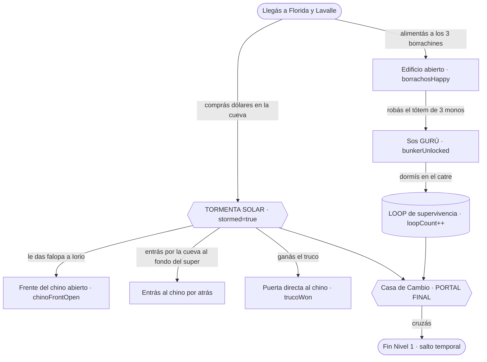

# SPEC: Grafo de historia + motor de pistas (la "didáctica" del juego)

- **Estado:** **Fase 1 casi completa (v=62)** — 11 aristas (crítico + secundario), motor + linyera
  enchufados. Diseño cerrado (§7). Falta solo: spawn errante del linyera + grounding del chat IA.
- **Nivel:** transversal (se estrena en Nivel 1)
- **Última actualización:** 2026-06-22

## 1. Contexto y objetivo

Hoy la **progresión de la historia** vive desparramada en flags sueltas dentro de `js/game.js`
(`stormed`, `borrachosHappy`, `trucoWon`, `bunkerUnlocked`, `chinoFrontOpen`, `gaveBeers`,
`hasCementoTicket`, `hasMegaDrive`, `fifaWon`, `loopCount`, `armado`…) y las **pistas** son estáticas
(el campo `hint:` de los borrachines + lo que cada `action` decide decir). No hay un lugar único que diga
**"la historia va así y se ramifica así"**, ni nada que, dado **dónde está parado el jugador**, sepa
**qué pista darle** sin spoilear.

Este spec define esa pieza: **el grafo de historia** (la narrativa como una **máquina de estados /
grafo de decisiones**, con disparadores como *la tormenta solar*) y, encima, un **motor de pistas**
(`HintEngine`) que consulta el grafo para responder *"¿qué conviene hacer ahora?"*. Ese motor es lo que
**luego** alimenta a un **NPC-guía** que tira pistas (scripteado y/o grounding para el chat IA).

**Cómo se diferencia de lo que ya hay (no se duplica):**
| Spec | Qué modela | Pregunta que responde |
|---|---|---|
| [`GRAFO.md`](GRAFO.md) | mundo/espacial + gating | *¿a dónde puedo ir?* |
| [`TECNICAS.md` §2](../TECNICAS.md) | quest DAG lock-and-key | *¿qué desbloquea qué?* |
| **este** | historia como estados + ramas + **pistas** | *¿en qué punto de la historia estoy y qué hago ahora?* |

Es un **RAG de decisiones**: el grafo es la base de conocimiento; el `HintEngine` hace el *retrieval*
(qué nodo/arista es relevante al estado actual); el NPC-guía es el *generation/presentation*.

## 2. Modelo del mundo (lo que ya existe)

- **Estado de la historia = vector de flags** (ya existen en `game.js`): `stormed`, `borrachosHappy`,
  `gaveBeers`, `fifaWon`, `trucoWon`, `bunkerUnlocked`, `chinoFrontOpen`, `hasCementoTicket`,
  `hasMegaDrive`, `armado`, `loopCount` + inventario del player (`coins`, `falopa`, `diosa/carne/fiambre`,
  `caramelos`, `hasMegaDrive`). **Estos flags YA SON los nodos de estado** — el spec no inventa estado
  nuevo, lo hace **explícito y consultable**.
- **Decisiones/disparadores = los `action:` de los NPCs/puertas** (ya existen en `level.js`): `borracho`,
  `truco`, `totem`, `lujo`, `iorio`, `fifa`, `chori`, `armas`, `loop`, `shop`, `chat`, `frogger`.
- **Disparador central — la tormenta solar:** en una **cueva** (sala 8/35/36/37) el cuevero del fondo
  te cambia dólares → **justo en ese momento revienta la tormenta** (`g.storm`, `g.cuevero.real`) →
  `stormed = true`. Es la **arista que parte la historia en dos** (pre-tormenta / post-tormenta).
- **Pistas hoy:** estáticas y locales (campo `hint:` en borrachines; cada `action` hardcodea su mensaje).

## 3. Diseño / narrativa

### 3.0 Cómo se llama esto (la teoría)
Para fijar vocabulario (y que no parezca magia "el linyera sabe todo"):

- **Estado del juego = vector de flags.** El "todo lo que está pasando" es el conjunto de flags de §2.
- **Máquina de estados / espacio de estados (reachability graph):** todos los estados posibles y las
  transiciones entre ellos. Es el "árbol de todo lo que el jugador puede iterar".
- **Modelo de planificación (precondición → acción → efecto), estilo STRIPS/PDDL:** la forma **compacta**
  de describir el espacio de estados **sin enumerarlo a mano**. Declarás por acción *"requiere X, produce
  Y"* y el grafo completo (qué destraba qué) **se deriva solo**. ← Esto es lo que se declara en las fichas.
- **Oráculo / planner:** un buscador (BFS/Dijkstra) sobre ese grafo. Desde el estado actual sabe **qué es
  alcanzable, qué falta y qué desbloquea qué**. **Así "sabe" el linyera**: no tiene el guion en la cabeza,
  *consulta el grafo y planifica* el próximo paso. (Es "un dios" porque ve el grafo entero, no porque se
  le escriba cada respuesta.)
- **Retrieval / grounding (el "RAG"):** recuperar del grafo el paso relevante al estado actual. Si el NPC
  habla por IA, ese paso se le pasa como **grounding** para que lo diga con su voz **sin inventar rutas**.

> **Decisión de arquitectura (resuelve "¿central o consultando a cada uno?"): las dos, en capas.**
> (1) **Cada ficha declara su pedacito** (precondición/efecto/pistas) — *definido en cada parte*.
> (2) Se **ensambla** un único **grafo omnisciente** a partir de todas las fichas — *el "dios", pero
> derivado, no un duplicado que se desincroniza*. (3) El linyera = **oráculo/planner** sobre ese grafo.
> Misma lógica que ya usa [`GRAFO.md`](GRAFO.md) (junta aristas de cada ficha) y los pools ` ```gen `.

### 3.1 El grafo de historia
Un **grafo dirigido** de **beats** (estados narrativos significativos) unidos por **aristas de decisión**.
Cada arista tiene **precondición** (flags + lugar + ítems), una **acción** (la decisión del jugador) y un
**efecto** (qué flags cambia). Ejemplo de la rama central:



(Los nodos `{{...}}` son disparadores; el diagrama completo y exhaustivo vive en este archivo y se deriva
del **artefacto de datos** de §3.3.)

### 3.2 El motor de pistas (`HintEngine`) — la "didáctica"
Dado el **estado actual** (los flags), el motor calcula la **frontera**: las aristas cuya precondición
está **a un paso** de cumplirse. Sabe **qué hiciste y qué te falta** (compara flags vs. aristas). De ahí
emite una pista, pero **el nivel de detalle sube con la INSISTENCIA del jugador**, no solo: arranca críptico
para hacerte **pensar**, y si seguís preguntando se va abriendo:

- **Nivel 0 — frase loca / filosófica:** te tira un acertijo que te hace pensar, sin nombrar nada.
  *"El verde se compra abajo, donde no llega el sol... pero el sol igual te va a encontrar, pibe."*
- **Nivel 1 — más claro (si repreguntás):** rumbo, pero todavía sin receta.
  *"¿Nunca bajaste a la cueva del fondo? Ahí cambian lo que vos buscás."*
- **Nivel 2 — directo (si seguís):** la receta concreta.
  *"Hablá con el cuevero del fondo y cambiá los dólares. Listo. Ahí arranca todo."*
- **Nivel 3 — se enoja (si lo cansás):** te lo dice sin vueltas y medio podrido.
  *"¡Que vayas a la CUEVA del fondo y CAMBIES, carajo! ¿Te lo dibujo?"*

El escalado es **por conversación / insistencia** (cuántas veces le repreguntás sobre lo mismo), no por
timer. Si cambiás de tema o resolvés el paso, vuelve a Nivel 0. Reglas (atadas a
[`ia-openrouter.md` §0](../ia-openrouter.md)):
- **La pista CRÍTICA la garantiza el código** (retrieval sobre el grafo), nunca el LLM. El chat IA del
  linyera es **flavor**: recibe la pista recuperada + el nivel de spoiler como **grounding** y la dice con
  su voz (críptica o podrida según el nivel); **no inventa rutas**.

### 3.3 De dónde sale el grafo: autoría distribuida → vista ensamblada
**Fuente de verdad = las fichas** (no un archivo central que haya que mantener sincronizado a mano). Cada
ficha de `personajes/`/`edificios/` declara **su arista** en un bloque estructurado (igual que hoy declara
sus pools ` ```gen `). Un paso de **ensamblado** junta todas las aristas en el **grafo omnisciente**.

**(a) Lo que declara cada ficha** — un bloque ` ```hist ` por decisión que ofrece la entidad:
```hist
id: disparar_tormenta
pre: { at: cueva }                 # precondición: lugar + flags + ítems
does: cambiar dólares con el cuevero del fondo
sets: { stormed: true }            # efecto: qué flags cambia (acá nace post-tormenta)
hints:                             # pistas por nivel de spoiler (i18n, es fuente)
  - Algo se huele raro abajo, en la cueva.
  - El negocio de verdad está en la cueva del fondo.
  - Hablá con el cuevero del fondo y cambiá: ahí arranca todo.
```
Otro ejemplo (ficha de los borrachines):
```hist
id: abrir_edificio
pre: { flags: { borrachosHappy: false } }
does: darle a cada borrachín lo que quiere (diosa / carne / fiambre)
sets: { borrachosHappy: true }
hints: [ "…", "…", "…" ]
```

**(b) El ensamblado** (un parser tipo `jobsFromFichas()`, que ya existe para los pools) compila todos los
` ```hist ` en una estructura única — el **modelo de planificación** que consume el motor:
```js
// estructura ENSAMBLADA (derivada, no escrita a mano)
Historia = {
  edges: [ { id:'disparar_tormenta', pre:{at:'cueva'}, sets:{stormed:true}, hints:[…] }, … ],
  // los "beats" (pre_tormenta / post_tormenta / gurú / loop / portal) se infieren de los flags
};
```

**(c) Validación (e2e):** que el grafo derivado no tenga **ciclos en el camino crítico**; que **toda**
`action:` real del nivel tenga su ` ```hist `; que cada `sets` sea precondición de otra arista o terminal
(estado final). Así el grafo omnisciente **nunca miente ni se desincroniza**: si una ficha cambia, el
grafo se recompila.

> Capa **aditiva**: el artefacto ensamblado (p. ej. `js/historia.js` generado, o leído de las fichas en
> runtime) va detrás de un `typeof Historia !== 'undefined'`; sin él, el juego anda igual.

### 3.4 El linyera filósofo como oráculo ERRANTE (futuro, "luego")
El **linyera filósofo** (ya chateable) es el **narrador omnisciente**: habla como un Diógenes medio
iluminado *porque ve el grafo entero*. Al hablarle, el juego corre `HintEngine.next(estado)` (= planner
sobre el grafo ensamblado de §3.3) y obtiene el/los próximos pasos de la frontera.

**No está fijo en un solo lado: es errante.** Aparece (o reaparece) **cerca de lo que NO hiciste** — el
motor elige, de las aristas de frontera, la **más cercana** al jugador (cercanía = lugar + qué tan a mano
está la precondición). Así el encuentro se siente orgánico: lo cruzás justo donde hay algo pendiente, y te
tira la frase loca sobre *eso*. Cómo lo dice:
- **Sin IA:** dice la pista del nivel de spoiler actual (§3.2), tal cual (i18n).
- **Con IA (chat):** se le pasa esa pista + el nivel como **grounding** en el system prompt y la transcrea
  con su voz canchera (ver [`glosario-transcreacion.md`](../glosario-transcreacion.md)). **La ruta sale del
  grafo, no del LLM** (regla de [`ia-openrouter.md` §0](../ia-openrouter.md)): el modelo le pone la voz, no
  inventa qué destraba qué.

**Multi-camino (Q4):** cuando hay varias aristas abiertas hacia el mismo objetivo (p. ej. entrar al chino
por **truco** / **Iorio** / **cueva**), el linyera empuja hacia la **más cercana/feasible** según dónde
estás parado — no las lista todas (eso spoilearía las rutas). Si te movés, puede cambiar de sugerencia.

Diégesis: que "sepa todo" y "aparezca donde te falta algo" queda justificado en la ficción — es el tipo
que se cansó del sistema, lo vio desde afuera y ahora *entiende cómo funciona la máquina*; deambula por
Florida y te cruza donde te estás trabando. El oráculo no rompe la inmersión: la explica.

## 4. Requisitos funcionales
- **RF-1:** Existe un grafo de historia declarativo (`Historia.beats` + `Historia.edges`) que cubre
  **todas** las decisiones reales del Nivel 1 (las `action:` y los flags de §2), incluido el disparador
  de la tormenta.
- **RF-2:** `HintEngine.next(estado, {cerca, insistencia})` devuelve, para cualquier estado válido, la
  arista de frontera **más cercana** y su pista al nivel de spoiler según la insistencia (0 frase loca →
  1 rumbo → 2 receta → 3 directo/enojado).
- **RF-3:** Las pistas son **i18n** (claves o catálogo, es-AR fuente; transcreación al inglés — ver
  [`glosario-transcreacion.md`](../glosario-transcreacion.md)).
- **RF-4:** Capa **aditiva**: sin `Historia`/`HintEngine`, el juego funciona igual (los flags y la lógica
  actual no dependen del grafo).
- **RF-5 (futuro):** Un NPC-guía consume el motor; si usa IA, la pista crítica viene del motor (grounding),
  no del LLM.

## 5. Estados y flags
No agrega flags nuevos: **reusa** los de `game.js` (§2). El aporte es **leerlos como un vector de estado**
y mapear cada transición a una arista. (Si más adelante se quiere, se puede refactorizar `game.js` para
que **escriba** los flags vía el grafo — fuera de alcance de este Draft.)

## 6. Criterios de aceptación
- El e2e puede **cargar `Historia`** y validar el grafo: sin ciclos en el camino crítico; cada `sets`
  tiene consumidor o es terminal; toda `action:` real del nivel está representada.
- Para una **secuencia de estados de ejemplo** (recién llegás → borrachines felices → tormenta → …),
  `HintEngine.next()` devuelve la pista esperada (test de tabla).
- Paridad i18n de las pistas (es/en).

## 7. Decisiones tomadas

Todo el diseño quedó cerrado; ya no hay preguntas abiertas para empezar a implementar.

**Arquitectura:**
- **¿Central o consultando a cada uno?** → **Autoría distribuida en las fichas (` ```hist `) + grafo
  ensamblado** (§3.3). No hay fuente central duplicada.
- **¿Cómo "sabe" el linyera?** → Es un **oráculo/planner** sobre el grafo ensamblado (§3.0, §3.4); la IA
  solo le pone la voz (grounding), no decide rutas.
- **¿Quién guía?** → El **linyera filósofo** que ya existe (no se agrega NPC nuevo).

**Resueltas con el dueño (las 5 de la iteración):**
1. **¿Describe o maneja los flags?** → **Solo DESCRIBE** (Fase 1): el grafo **lee** los flags que `game.js`
   ya setea, para saber dónde estás y dar pistas. **No toca la lógica que ya anda.** (Que el grafo *maneje*
   los flags = sea el dueño del estado = refactor de Fase 2, **descartado por ahora**.)
2. **¿Runtime o pre-compilado?** → **Pre-compilado**: un script (estilo `gen-dialogos.mjs`) lee las fichas
   en la compu y escribe `js/historia.js` listo; el juego solo lo carga (no parsea markdown en el browser).
3. **Política de spoiler** → **Escalado por INSISTENCIA** (§3.2): arranca con una **frase loca/filosófica**
   para hacerte pensar; si repreguntás sobre eso, se pone **más claro**; si lo cansás, **se enoja y te lo
   dice directo**. El linyera sabe **qué hiciste y qué no** (compara flags vs. grafo). Se reinicia al
   resolver el paso o cambiar de tema.
4. **Multi-camino** → El linyera es **errante**: aparece/reaparece **cerca de lo que no hiciste** y empuja
   hacia la arista de frontera **más cercana/feasible** (no lista todas las rutas). Ver §3.4.
5. **Alcance** → **Todo**: camino crítico **y** secundarios (búnker/loop, FIFA, disquería→Cemento, armas,
   etc.). El linyera puede ayudar con cualquier cosa pendiente.

**Plan de implementación / estado (v=61):**
- [x] **(a)** Bloques ` ```hist ` (JSON) en las fichas — **camino crítico**: `tormenta` (cueveros),
  `edificio` (borrachines), `bunker` (linyeras), `chino_iorio` (iorio), `truco` (tahur), `portal`
  (casa-de-cambio). Cada uno con `pre`/`sets`/`hints` es+en × 4 niveles.
- [x] **(b)** `tools/gen-historia.mjs` ensambla `js/historia.js` (6 aristas) + validación (ids únicos, sin
  ciclos triviales, flags sueltos avisados). Escanea solo `personajes/`+`edificios/`.
- [x] **(c)** `js/hint-engine.js`: `HintEngine.next(estado, {at, insistencia})` — frontera + cercanía +
  nivel por insistencia, bilingüe vía `I18n`. Capa aditiva. Testeado en el e2e.
- [x] **(d parcial)** Linyera enchufado: al abrir el chat tira pista nivel 0; cada repregunta sube el
  nivel (0→3). Lee los flags reales de `game.js` (Fase 1: solo describe).
- [x] **Aristas secundarias (v=62):** `megadrive`, `fifa`, `cemento_ticket`, `armas`, `loop` — el linyera
  **ayuda en todo** (11 aristas en total). Prioridad: el camino crítico (`pri` default 10) gana al
  secundario (`pri` 20+); por cercanía, en cada lugar sugiere lo de ahí. Flag espejo `armado` en `game.js`
  (1 línea, no refactor) para detectar la compra de armas; `sleptOnce = loopCount>0` para el loop.
- [ ] **Pendiente:** **spawn errante** del linyera (que aparezca cerca de lo no hecho, no solo en la calle);
  **grounding** del chat IA con la pista recuperada (hoy la pista es scripteada aparte; falta pasarla al
  system prompt del LLM como contexto).
